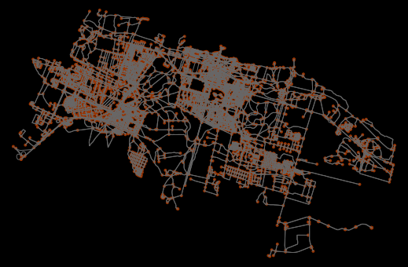

# Hackathon "Healthy City" in St.Petersbourg
Welcome to Open data days 2020 in Snt.Petersbourg, hackathon "Healthy City for equal development"  

## Dates: 
7-9 March 2020 Open data days in Russia https://github.com/okfn/opendataday
together with joint global initiative https://opendataday.org/ 

## Organisers: 
Vitaly Vlasov (ITMO), Natasha Chichkova (ITMO), Liubov Tupikina (CRI, Bell) 
Informational support: Vlad Lavrichenko (Teplitsa)
http://www.ifmo.ru/ru/ (work in progress)

## Event description
Topics of hackathon are all united by the general topic of equal development. Subtopics include: 
1. Urbanistics, 
2. Data science for social good, small and big data analysis, 
3. Open city, open education, open data in healthy city
4. Health data analysis 
Program of the hackathon will be published in March 2020.

## Abstract of the event
The hackathon is dedicated to the topic of healthy life in the city. In particular, it is focused on the main topics, such as data science for social good, analysis of big data by citizens, such as mobility data, data about hospitals reachability etc. 
One of the main motivations for the hackathon is to develop future projects between and across different disciplines: open data management and collection, urbanistic research, physics, transportational systems analysis, computer science (machine learning methods, development of fast and reliable algorithms for data structures).

## Participation
All participants can come in teams or find their team before the event. 
Approximate number of participants is around 50 people. The event is open to everyone. Program will be posted soon! Next event will be in Spring of 2020 dedicated to International Open Data days. Please check the website of our friends to learn more about hackathons in St.Petersburg https://github.com/OpenCityRu and https://te-st.ru/events/hackathon-spb-projector2020/ 

## Visa questions 
If you need visa, please go to https://pulkovoairport.ru/en/passengers/evisa/
Do not hesitate to ask us if you have any questions!

## Registration
Registration in English https://forms.gle/5YYGi1qtE1HP4yzq6 

Please write to us if you want to be involved 
liubov.tupikina at cri-paris.org
inxaoc at gmail.com

# Russian version of the website 

Даты:

   
    март 7-9, 2020 год, конференция посвящена Международным дням открытых данных: https://opendataday.org/ 

Организаторы:

Виталий Власов (ITMO), Наташа Чичкова (ITMO), Любовь Тупикина (CRI, Bell) Информационная поддержка: Влад (Теплица)
Описание события

Темы хакатона:

    Урбанистика,
    Анализ данных на благо общества,
    Aнализ больших данных,
    Открытый город, открытое образование, открытые данные
    Анализ медицинских данных

Резюме мероприятия

Хакатон посвящен теме здорового образа жизни в городе. В частности, он сосредоточен на основных темах, таких как анализ данных для общественного блага, анализ больших данных: данные о мобильности, данные о достижимости больниц и т.д. Одной из главных мотиваций хакатона является разработка будущих проектов между различными дисциплинами: aнализ и сбор открытых данных, урбанистические исследования, физика, анализ транспортных систем, информатика (методы машинного обучения, разработка быстрых и надежных алгоритмов для структурных данных).

Участие

Все участники могут прийти в команды или найти свою команду до начала мероприятия. Приблизительное число участников - около 50 человек. Мероприятие открыто для всех. Программа скоро будет опубликована!

Регистрация на английском языке https://forms.gle/5YYGi1qtE1HP4yzq6 
Пожалуйста, напишите нам, если вы хотите принять участие liubov.tupikina at cr-paris.org inxaoc at gmail.com.
